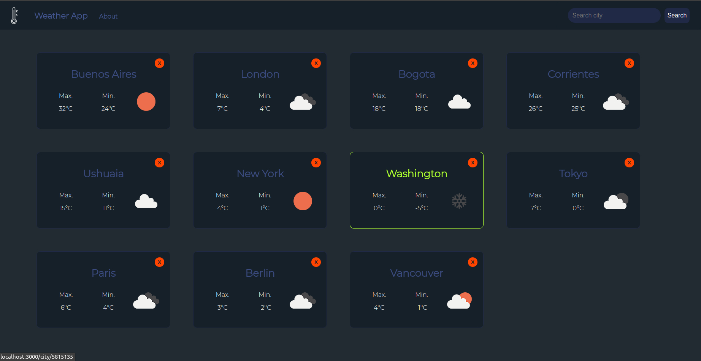
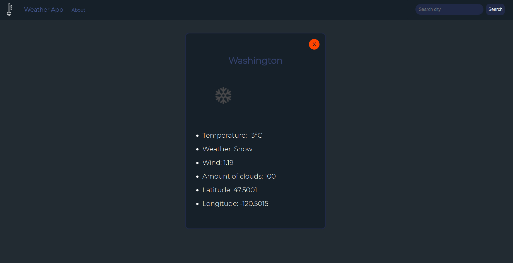

# Weather App

## About the project

Weather forecasting application that enables users to check real-time weather information from different places around the world.
The data is fetched from an external API via HTTP.

#### Cities cards

#### City detail

## Technologies used

- JavaScript
- HTML
- CSS
- React

## Run locally

- Clone repository in your computer.
- Install NodeJS (version >= 12.18.3) and npm (version >= 6.14.16).
- Execute `npm install` on root folder.
- Execute `npm run start` on root folder.
- Navigate to `http://localhost:3000` in your browser.
